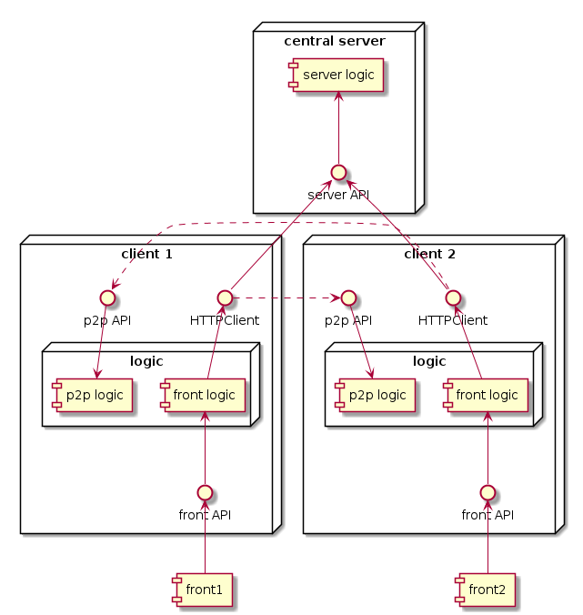

# Demo p2p chat

# Architecture & dev principles
- __clean architecture__ (aka ports & adapters)
    - core data structures are in [domain](./backend/domain/)
    - usecases (business logic) in [uc](./backend/uc/)
    - driving ports (calling usecases) in [driving](./backend/driving/)
    - driven ports (called by usecases) in [driven](./backend/driven/)
- __CQRS__ :
  - if a function modifies the state of the system, it returns nothing (errors don't count)
  - if a function returns something, it doesn't modify the system
- __BDD__ with [goConvey](http://goconvey.co/)
- a single repo and a shared codebase is used for both central server and clients, it's just for the convenience in order to speed up a little bit the dev of this project

## Global architecture



### Example 

You can play a little scenario where Alice and Bob register to the central server, then exchange a few messages directly 
with each other and finally check their conversations.

Run :
```$xslt
docker-compose up -d
./test.sh
```

To see how everything behaves, open the tracing UI [http://localhost:16686/](http://localhost:16686/)

## Security flaws
1. users are only authenticated between them with their username as a header, this can easily be spoofed
1. everything is transmitted in plain text
1. clients don't authenticate between each other
1. a client could enumerate others users

Remediation, example PKI :
1. the server API can be publicly authenticated with a known root CA (to mitigate mim attacks between client -> server)
1. the server has a key pair provided at startup (sPK, sSK) to allows the system to work with several servers (using the same keys)
1. the server self-signs its own certificate (sC) using sSK
1. when a client opens a new session with the server, it receives : 
    - the self-signed certificate (sC) containing sPK 
    - its own certificate signed with sSK (c1C)
1. the client installs sC
1. the client serves the p2p API using c1C

1. when another client (c2) having followed the same steps above attempts to call another on c1 :
1. the request is made using its certificate (clientCertificate : c2C)
1. c1 can check if c2C has been signed with sC
1. c2 can check if c1C has been signed with sC
1. then mTLS secures the communication between the peers

## TODO
- add the tests to remaining usecases, at least happy cases, server is fine for the rest
